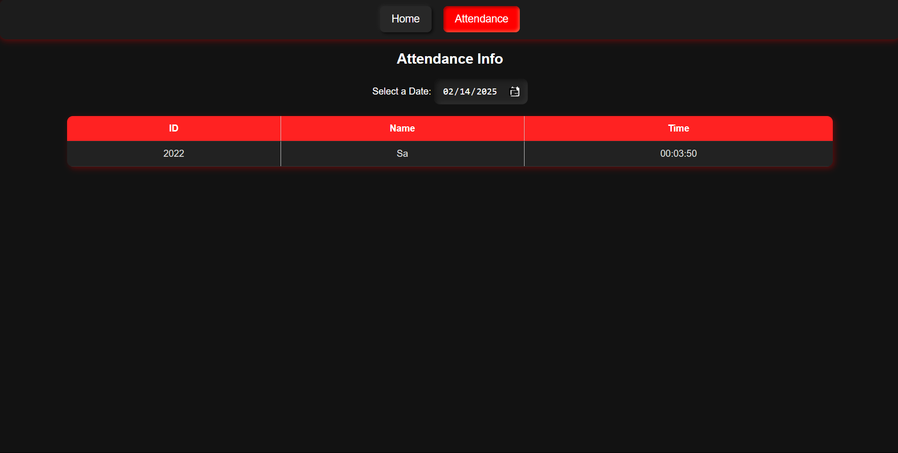

# 🎭 Face Recognition Attendance System  

A **cutting-edge, AI-powered** Face Recognition Attendance System with a **sleek, neumorphic UI**—built using **Flask, OpenCV, PyTorch, and SQLite**. Effortlessly register faces, verify identities, and track attendance in real-time!  

🔥 **Seamless. Secure. Smart.**  

---

## 🚀 Features at a Glance  
✔️ **AI-Powered Face Detection** – No manual input needed. Just look at the camera!  
✔️ **Real-Time Face Recognition** – Instant verification with deep learning models.  
✔️ **Automated Attendance Logging** – Mark attendance with a single glance.  
✔️ **Intelligent Dashboard** – Track attendance records with filters & calendar view.  
✔️ **Neumorphic UI** – A modern, minimalist design that looks stunning.  

---

## 🛠️ Tech Stack  

| **Category**  | **Technologies** |
|--------------|----------------|
| **Backend**  | Flask, OpenCV, PyTorch, SQLite |
| **Frontend** | HTML, CSS (Neumorphic Design), JavaScript |
| **Database** | SQLite (Face Embeddings & Attendance) |
| **Data Handling** | Pandas (CSV-based Attendance Tracking) |

---

## 📸 How It Works  

### 🔴 **Step 1: Register Faces**  
👤 Click **"Register"** and let the system capture & store face embeddings securely.  

### 🟢 **Step 2: Verify Faces**  
🔍 Click **"Verify"** and the system will **instantly** identify registered users.  

### 📅 **Step 3: Mark Attendance**  
✅ Click **"Take Attendance"** and attendance is **automatically logged** in real-time!  

⏳ **Data is stored in `attendance.csv` and displayed in a modern, interactive UI.**  

---

## 📊 Advanced Attendance Tracking  
🔹 **Dynamic Table:** View attendance history effortlessly.  
🔹 **Powerful Filters:** Sort by month, day, hour, and minute.  
🔹 **Interactive Calendar:** Visualize attendance patterns at a glance.  

---

## 🎨 UI Preview  

| **Home Page** | **Attendance Dashboard** |
|--------------|----------------------|
|  |  |

---

## 🚀 Installation & Setup  

### **1. Clone the Repository**  
```sh
git clone https://github.com/your-username/face-recognition-attendance.git  
cd face-recognition-attendance
```

### **2. Install Required Libraries**  

```sh
pip install -r requirements.txt
```

### **3. Run the Application**  

```sh
python app.py
```

### **4. Open the Web App**  


Go to http://127.0.0.1:5000/ in your browser

