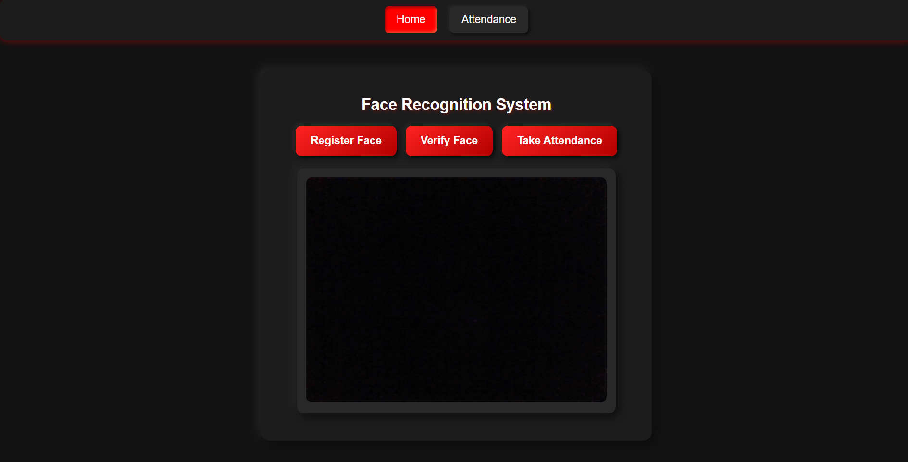

# 📸 Face Recognition Attendance System  

A sleek **neumorphic-style** **Face Recognition Attendance System** built using **Flask, OpenCV, PyTorch**, and **SQLite**. This system allows users to **register faces, verify identities, and mark attendance** seamlessly—all within a modern, responsive web interface.  

---

## 🚀 Features  
✅ **Face Registration** – Capture and store face embeddings securely.  
✅ **Face Verification** – Identify registered users in real time.  
✅ **Attendance Marking** – Log attendance with timestamped records.  
✅ **Interactive Dashboard** – View attendance with date filtering & a calendar.  
✅ **Neumorphic UI** – A clean, modern, and intuitive design.  

---

## 🖥️ Tech Stack  
- **Backend:** Flask, OpenCV, PyTorch, SQLite  
- **Frontend:** HTML, CSS (Neumorphic design), JavaScript  
- **Database:** SQLite (for attendance & face embeddings)  

---

## 📂 Project Structure  

/face-recognition-attendance
│── /static                # Frontend assets (CSS, JS, images)
│── /templates             # HTML templates (Home, Attendance page)
│── attendance.csv         # CSV file storing attendance logs
│── app.py                 # Main Flask application
│── capture_faces.py       # Face registration script
│── verify_faces.py        # Face verification script
│── database.py            # SQLite database operations
│── requirements.txt       # Required dependencies
│── README.md              # Project documentation (this file)

## 📸 How It Works  

### 🔴 Step 1: Register Faces  
1. Click **"Start Register"**  
2. The system captures images and processes face data  
3. Face embeddings are extracted and stored in the database  

### 🟢 Step 2: Verify Faces  
1. Click **"Verify"**  
2. The system captures a new face image and compares it with stored embeddings  
3. If a match is found, a **"Verified"** message is displayed  

### 📅 Step 3: Mark Attendance  
1. Click **"Start Attendance"**  
2. The system detects and verifies the face in real-time  
3. If recognized, attendance is **automatically logged** with the timestamp  
4. Data is stored in `attendance.csv` and displayed in the UI  

---

## 📊 Attendance Tracking  
- View attendance records in a **dynamic table**  
- **Filter records** by month, day, hour, and minute using the datepicker  
- **Calendar UI** highlights attendance times for selected days  

## 🎨 UI Preview 

## 🛠️ Built With  

### **Frontend**  
- **HTML, CSS, JavaScript** – For the neumorphic UI  

### **Backend**  
- **Flask** – Lightweight Python web framework  
- **OpenCV** – Face detection & recognition  
- **PyTorch** – Face embedding extraction  
- **SQLite** – Stores registered face data  
- **Pandas** – Attendance tracking & CSV handling  
